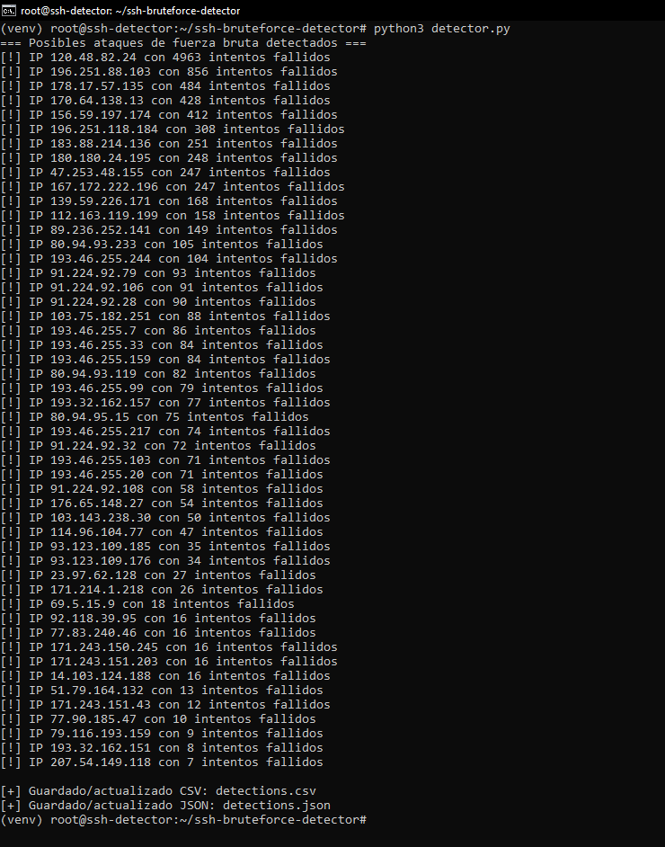
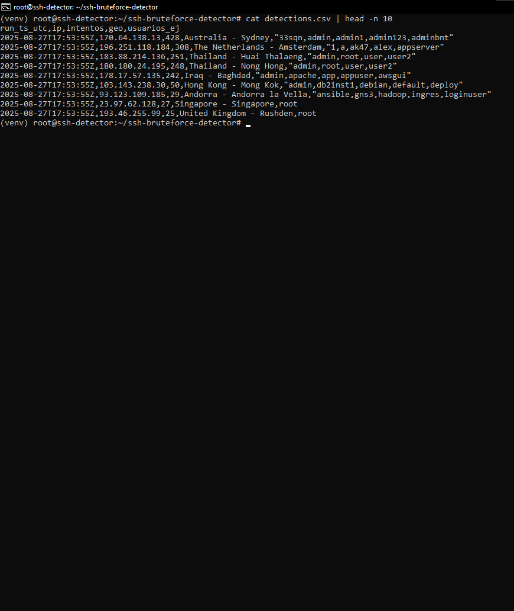

# SSH Brute Force Detector 🔐

Este proyecto es un script en **Python** que analiza los registros de autenticación de un servidor Linux (`/var/log/auth.log`) para detectar **intentos de ataque de fuerza bruta en SSH**.

## 🚀 Características
- Detecta IPs con múltiples intentos fallidos de login por SSH.
- Guarda resultados en **CSV** y **JSON** (histórico).
- Incluye **geolocalización** de IPs (país/ciudad).
- Se puede automatizar con **cron** para correr cada hora.


## 📂 Archivos
- `detector.py` → Script principal.
- `detections.csv` → Histórico de IPs en CSV.
- `detections.json` → Histórico en JSON.
- `requirements.txt` → Dependencias del proyecto.

## ⚙️ Instalación
```bash
git clone https://github.com/JoaGranzowA/ssh-bruteforce-detector.git
cd ssh-bruteforce-detector
python3 -m venv venv && source venv/bin/activate
pip install -r requirements.txt

## 📸 Ejemplos de uso

### 🔎 Ejecución del detector


### 📊 Datos guardados en CSV

